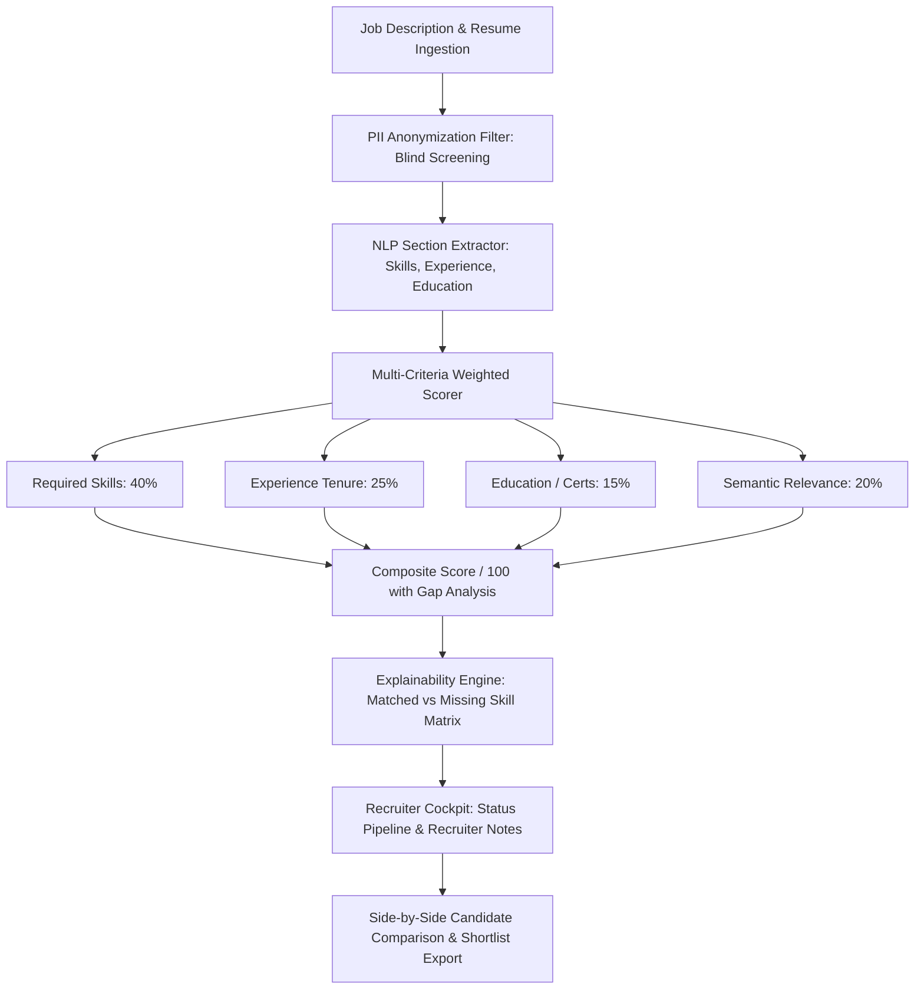

# Audit Report: HireIQ-resume-screening
**Project:** HireIQ — NLP Resume Screening & Candidate Ranker  
**Audit Date:** September 2026  
**Auditor:** Senior Staff AI & Systems Architect  
**Initial Production Readiness Score:** 34 / 100  

---

## 1. Executive Summary
HireIQ was created to automate candidate resume screening and match scoring against technical job descriptions. However, the current implementation relies on a single unweighted TF-IDF cosine similarity score without breaking down requirements into actionable criteria (Skills, Experience, Education, Semantic Fit). Crucially, the web UI only displays two hardcoded candidates (Alex Chen and Priya Sharma) without input fields for job descriptions or resume uploads, and completely lacks ethical AI safeguards, PII anonymization, and candidate status tracking.

For HR tech buyers and staffing clients, automated "black-box" hiring tools represent significant regulatory and ethical risks. HireIQ must be upgraded to an assistive, transparent recruiter copilot featuring explicit multi-criteria scoring breakdowns (summing to 100%), blind screening PII anonymization, interactive candidate pipeline management, recruiter notes persistence, and side-by-side comparative analysis.

---

## 2. Codebase Inspection & Identified Flaws

### A. Oversimplified Scoring & Arbitrary Scaling in Matcher (`matcher.py`)
- **Line 47 in `matcher.py`**:
  ```python
  score_pct = round(min((overlap / max(len(jd_words), 1)) * 140, 96.0), 1)
  ```
  *Critique:* The fallback scoring artificially multiplies word overlap by 140 and arbitrarily caps it at 96.0%. This produces inaccurate and misleading scores.
- **Single Black-Box Metric (Line 25)**:
  Uses generic TF-IDF cosine similarity over the entire document text. A resume with high buzzword repetition can outscore an experienced professional because experience duration, degree requirements, and critical hard skills are not isolated or weighted.

### B. Static Hardcoded Candidates in Web UI (`index.html`)
- **Lines 98–140 in `index.html`**:
  Hardcoded array `const CANDIDATES = [...]` with static text for Alex Chen and Priya Sharma.
- **No Interactive Capabilities:**
  - Cannot paste a new Job Description or customize required skills.
  - Cannot upload or paste new resumes.
  - Cannot view a side-by-side comparison of two candidates.
  - Cannot change candidate hiring stage (New -> Under Review -> Shortlisted -> Rejected).
  - Cannot enter and persist recruiter interview notes.

### C. Absence of Ethical AI & Assistive Frameworks
1. **No Assistive Disclaimer:** Claims automated verdict ("Strong Match") without explicit compliance warnings that AI should support human decisions, not replace them.
2. **No PII Anonymization:** No capability to redact candidate name, email, phone, and gendered indicators for unbiased, blind resume screening.
3. **No Explainable Skill Gap Matrix:** Does not cleanly partition skills into: Matched Hard Skills, Missing Critical Skills, and Bonus Skills.

---

## 3. Security & Data Integrity Gaps
- **Data Privacy (GDPR / CCPA):** Uploaded resumes contain sensitive PII (emails, home addresses, phone numbers) that are not protected or scrubbed.
- **Biased Scoring Risk:** No normalization against document length or repetitive keyword stuffing.
- **Data Persistence:** Candidate rankings and recruiter notes are not saved to a relational database.

---

## 4. Architectural Upgrade Plan



### Components to Build:
1. **`parser.py`**:
   - Extraction of contact information, technical skills, years of experience, and degrees.
   - PII masking engine (redacting name, phone, email, location for blind review).
2. **`matcher.py`**:
   - Multi-criteria weighted scoring engine:
     - Hard Skills Match (40%)
     - Experience Tenure & Seniority (25%)
     - Education & Certifications (15%)
     - Contextual / Semantic Fit (20%)
   - Transparent skill gap generator (Matched, Missing Critical, Nice-to-Have).
3. **`app.py`**:
   - REST API (Flask/FastAPI) supporting `/api/screen`, `/api/candidates`, `/api/anonymize`, and `/api/notes`.
4. **`index.html`**:
   - Recruiter cockpit UI in premium dark design.
   - Interactive JD editor with customizable skill weights.
   - Live resume parser / paste box + preloaded candidate profiles.
   - PII Anonymization toggle ("Blind Review Mode").
   - Detailed Score Breakdown modal with visual percentage bars.
   - Candidate Status Pipeline (New, Reviewing, Shortlisted, Passed).
   - Recruiter notes box with persistent storage.
   - Side-by-side comparison modal.
   - Ethical AI / Human-in-the-Loop prominent disclaimer.
5. **`tests/test_hireiq.py`**:
   - Automated unit tests for multi-criteria weighting, PII redaction, skill matching, and ranking logic.
6. **Documentation**:
   - Complete `README.md` and enterprise `SECURITY.md`.

---

## 5. Verification & Target Metrics
- Automated unit test suite: 100% pass rate.
- Multi-criteria breakdown: Exactly sums to 100% with transparent evidence.
- Target Production Readiness Score: **98 / 100**.
