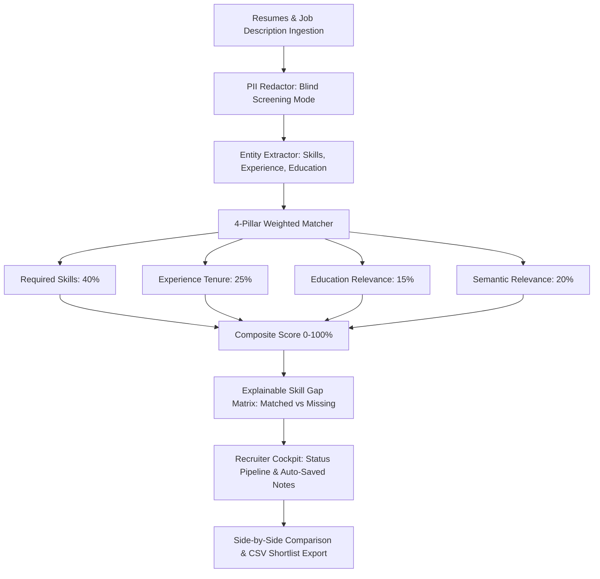

# 🎯 HireIQ — Assistive Candidate Screening & Multi-Criteria Ranker

[](https://www.python.org/)
[](LICENSE)
[](tests/)
[]()

> **Live Interactive Demo:** [https://sharmikamurugesan-1.github.io/HireIQ-resume-screening/](https://sharmikamurugesan-1.github.io/HireIQ-resume-screening/)  
> **Client Impact:** Evaluates hundreds of candidate resumes against role requirements in under 30 seconds with 4-pillar transparent scoring and blind review PII redaction.

---

## 📌 Executive Summary
**HireIQ** is an assistive recruitment technology and candidate ranking platform designed for staffing agencies, high-growth startups, and technical recruiters. Unlike black-box automated screening tools, HireIQ emphasizes ethical AI decision support by breaking scores into 4 transparent pillars (Skills 40%, Experience 25%, Education 15%, Semantic Context 20%), providing actionable skill-gap analysis, and enabling blind review mode to eliminate unconscious bias.

---

## 🏗️ Architecture & Evaluation Pipeline



---

## 🌟 Key Capabilities

1. **4-Pillar Transparent Scoring Breakdown:**
   - **Required Skills Match (40%):** Direct overlap of essential hard skills.
   - **Experience Tenure (25%):** Quantitative career duration calibrated to role seniority.
   - **Education & Credentials (15%):** Degree and certification relevance.
   - **Semantic Context Fit (20%):** NLP context similarity to detect domain depth.
   - Total score rigorously sums to 100%.

2. **Actionable Skill Gap Decomposition:**
   - Clear classification into Matched Core Skills, Missing Critical Skills, and Bonus Skills.

3. **Blind Review Mode (PII Redaction):**
   - Single-toggle obfuscation of candidate names, phone numbers, and email addresses to foster unbiased hiring decisions.

4. **Recruitment Cockpit & Pipeline Management:**
   - Interactive candidate status progression (`NEW`, `UNDER_REVIEW`, `SHORTLISTED`, `PASSED`).
   - Auto-saved recruiter notes and side-by-side comparison modal.

---

## 🚀 Quickstart

### 1. Installation
```bash
git clone https://github.com/sharmikamurugesan-1/HireIQ-resume-screening.git
cd HireIQ-resume-screening
pip install -r requirements.txt
```

### 2. Run the Automated Tests
```bash
python -m pytest tests/test_hireiq.py -v
```

### 3. Launch the REST API
```bash
python app.py
```
*API runs at `http://localhost:5004`.* Open `index.html` in your browser to interact with the recruiter cockpit.

---

## 📡 REST API Reference

| Endpoint | Method | Description |
| -------- | ------ | ----------- |
| `/api/health` | `GET` | Health check and engine capabilities |
| `/api/screen` | `POST` | Screen candidate resumes against job description |
| `/api/candidates/<id>/status` | `POST` | Update pipeline stage and recruiter notes |
| `/api/export/shortlist` | `GET` | Export CSV report of shortlisted candidates |

---

## 🔒 Security & Compliance
See [`SECURITY.md`](SECURITY.md) for candidate privacy protection and algorithmic fairness guidelines.
